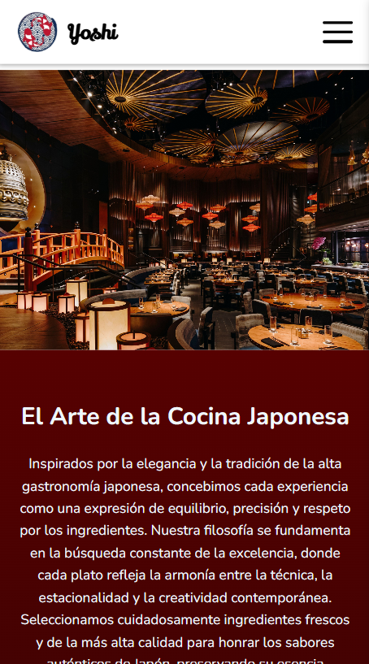
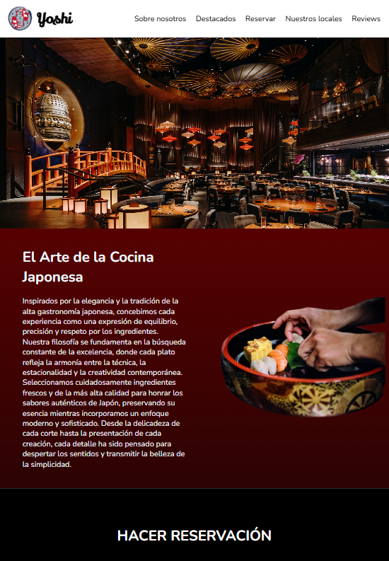
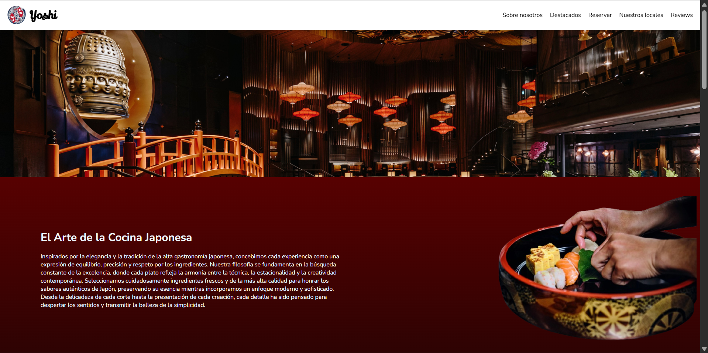

# Yoshi — Responsive Japanese Restaurant Website

A fully responsive restaurant website built with **HTML5** and **CSS3**, developed as part of the *Diseño y Programación Web* course (Universidad CENFOTEC) — Assignment 2.

## Description

**Yoshi** is a fictional Japanese fine-dining restaurant website designed to adapt seamlessly across mobile, tablet, and desktop screen sizes. It was built with semantic HTML and custom CSS (no frameworks), applying CSS Grid/Flexbox layouts and media queries to ensure a consistent, elegant experience on any device.

## Features

- Semantic structure with `header`, `nav`, `section`, and `footer`
- Fixed header with logo and a responsive navigation menu
- Mobile hamburger menu built with the CSS checkbox hack (no JavaScript)
- Hero section with a full-width featured image
- "Sobre nosotros" (About us) section describing the restaurant's philosophy
- Table reservation form (date, time, number of guests)
- Locations ("Nuestros locales") section listing branches
- "Destacados" section with 6 featured dish cards, each with image and description
- Customer reviews ("Reviews") section
- Footer with contact info and copyright
- Fully responsive layout using Grid/Flexbox and 3 media query breakpoints

## Built With

- HTML5
- CSS3 (Grid, Flexbox, Media Queries)
- Google Fonts (Lily Script One, Nunito)

## Responsive Breakpoints

| Device     | Breakpoint        |
|------------|-------------------|
| Desktop    | above 1024px      |
| Tablet     | up to 1024px      |
| Mobile     | up to 768px       |
| Small mobile | up to 480px     |

## Project Structure

```
yoshi-restaurant/
├── HTML/
│   └── main.html
├── CSS/
│   └── style.css
├── Media/
│   ├── logo restaurante.png
│   ├── Restaurante.png
│   ├── sushi.png
│   ├── sucursales.png
│   └── platillo *.jpg
├── Screenshots/
│   ├── mobile.png
│   ├── tablet.png
│   └── desktop.png
└── README.md
```

> Note: `main.html` references its assets with relative paths (`../CSS/style.css`, `../Media/...`), so the folder names above (`HTML`, `CSS`, `Media`) must match exactly for the page to render correctly.

## Screenshots

| Mobile | Tablet | Desktop |
|--------|--------|---------|
|  |  |  |

## Getting Started

1. Clone this repository:
   ```bash
   git clone https://github.com/fabi-murillov/responsive-ui-project.git
   ```
2. Open `HTML/main.html` in your browser — no build steps or dependencies required.

## Author

**Fabiola Murillo Vásquez**
Diseño y Programación Web (SOFT-06) — Universidad CENFOTEC
2026-C2

## License

This project was created for academic purposes as part of a university course assignment.
